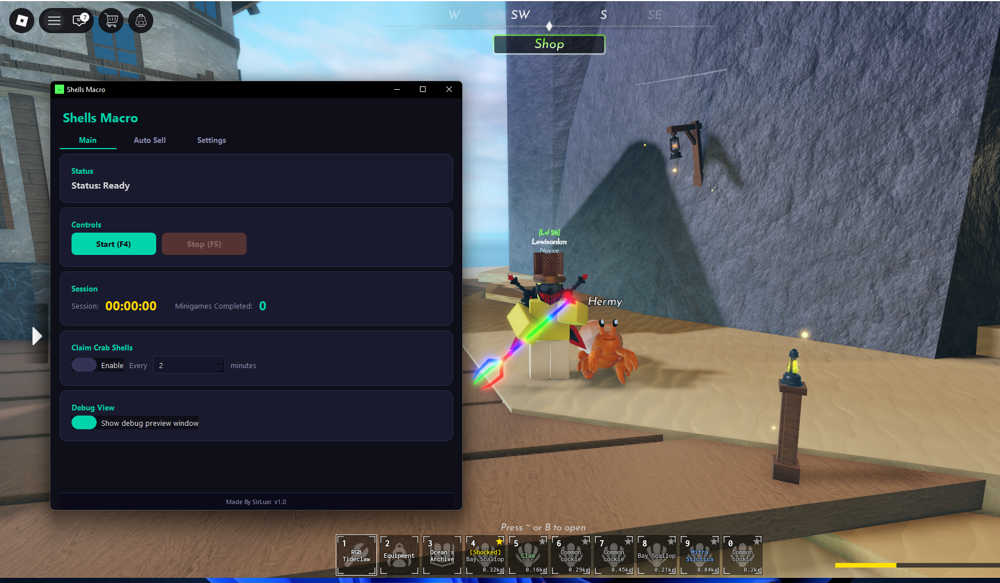

# Shells Macro

---

<--  -->

## 🚀 Getting Started

### Installation
1. Go to the [**Releases**](../../releases/latest) tab
2. Download `the latest file`
3. Run the macro if Windows Defender warns you, click **More info → Run anyway** (this is normal for new apps without an EV certificate)
4. Launch the macro and open Roblox

### Usage
1. Load into **Shells** in Roblox
2. Press `F4`) to Start

| Hotkey | Action |
|--------|--------|
| `F4` | Start |
| `F5` | Stop |

*Built by SirLuxi*

